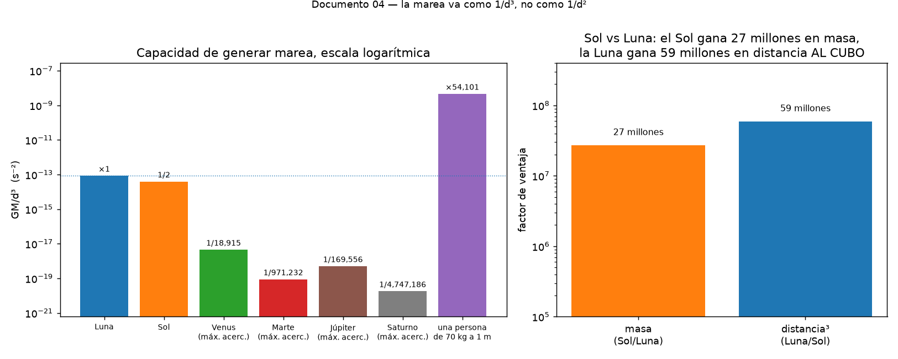

# ¿Por qué la Luna gana al Sol? (y por qué Júpiter no cuenta)

El Sol tiene **27 millones de veces** más masa que la Luna. Y sin embargo levanta
una marea que es menos de la mitad de la lunar.

La razón es una sola: la marea no va como 1/d², va como **1/d³**.



---

## De dónde sale el cubo

La atracción gravitatoria va como 1/d². Pero la marea no es la atracción, es la
**diferencia** de atracción entre un lado de la Tierra y el otro (ver
[01-por-que-hay-dos-mareas-al-dia.md](01-por-que-hay-dos-mareas-al-dia.md)). Es
decir, es una *derivada*:

```
        GM                    d      GM         GM
a  =  ────      →     Δa ≈  ──── ( ──── ) R = 2 ──── R
        d²                    dd     d²          d³
```

Derivar 1/d² da 1/d³. Cada vez que tomas la diferencia de una fuerza en vez de la
fuerza, ganas una potencia de la distancia en el denominador. Es todo.

La consecuencia práctica es que **la distancia importa muchísimo más de lo que la
intuición sugiere**, y la masa muchísimo menos.

---

## Las cuentas

El parámetro que mide la capacidad de levantar marea es GM/d³:

| cuerpo | GM (m³/s²) | distancia (m) | GM/d³ (s⁻²) | vs Luna |
|---|---|---|---|---|
| Luna | 4.90 × 10¹² | 3.84 × 10⁸ | 8.64 × 10⁻¹⁴ | 1 |
| Sol | 1.33 × 10²⁰ | 1.50 × 10¹¹ | 3.96 × 10⁻¹⁴ | 0.46 |

La razón sale **2.18** a favor de la Luna. Es el número que el programa
`03_tidal_bulge.py` calcula y verifica.

Merece la pena ver cómo se compensan los dos factores:

- El Sol gana en masa por un factor de **27,000,000**.
- La Luna gana en distancia por un factor de 390, pero **al cubo**: 390³ ≈
  **59,000,000**.

59 contra 27. Gana la Luna, aunque no por mucho — y esa cercanía es lo que hace
interesantes las mareas terrestres. Si el Sol dominase claramente, la marea
tendría un período de 12 h exactas y no habría ciclo de vivas y muertas. Si la
Luna dominase por completo, tampoco. El ciclo de sicigias existe precisamente
porque los dos son comparables.

---

## Júpiter no cuenta. Ni de lejos.

Esta es la parte divertida, y sirve para desmontar unas cuantas afirmaciones que
circulan por ahí.

Tomemos Júpiter en su máximo acercamiento a la Tierra (unas 4.2 UA):

| cuerpo | GM/d³ (s⁻²) | fracción de la marea lunar |
|---|---|---|
| Luna | 8.6 × 10⁻¹⁴ | 1 |
| Sol | 4.0 × 10⁻¹⁴ | 0.46 |
| **Venus** (máx. acercamiento) | 4.6 × 10⁻¹⁸ | 1 / 19,000 |
| **Júpiter** (máx. acercamiento) | 5.1 × 10⁻¹⁹ | 1 / 170,000 |

Dos cosas llamativas:

1. **Júpiter levanta una marea 170,000 veces menor que la Luna.** Sobre una marea
   de equilibrio de ~25 cm, eso son **1.5 micras**. Menos que el grosor de un pelo.
2. **Venus le gana a Júpiter**, por un factor de 9, pese a tener 400 veces menos
   masa. Otra vez el cubo: Venus se nos acerca a 0.28 UA y Júpiter no baja de 4.2.

Por eso las "alineaciones planetarias" no tienen ningún efecto mareal detectable.
No es escepticismo genérico: es que el número es 10⁻⁵.

### El remate

Calculemos GM/d³ para **una persona de 70 kg sentada a un metro de ti**:

```
G · 70 kg / (1 m)³ = 4.7 × 10⁻⁹ s⁻²
```

Eso es **54,000 veces** el parámetro mareal de la Luna, y unas 10¹⁰ veces el de
Júpiter.

(Con honestidad: a un metro de distancia y con un cuerpo de un metro de tamaño, el
desarrollo multipolar en el que se basa el parámetro GM/d³ ya no es estrictamente
válido, así que no lo tomes como una predicción cuantitativa de deformación. Pero
como comparación de capacidad de generar gradiente gravitatorio, el orden de
magnitud es real.)

La moraleja: si alguien te dice que la Luna "controla el agua de tu cuerpo porque
el cuerpo es 70% agua", la persona que tienes al lado la está controlando 54,000
veces más. Y lo que sí controla la Luna, el océano, lo controla porque es una masa
de agua de miles de kilómetros de extensión, libre de moverse horizontalmente
durante horas. Un vaso de agua —o una persona— no cumple ninguna de las dos
condiciones.

---

## Un corolario: por qué la marea sube más en perigeo

Si la marea va como 1/d³, entonces las variaciones de distancia se amplifican por
tres.

La distancia Tierra-Luna oscila entre unos 356,800 km (perigeo) y 406,300 km
(apogeo), un ±6.5%. Al cubo:

```
(406,300 / 356,800)³ = 1.48
```

Un **48%** de diferencia en la intensidad de la marea lunar entre apogeo y
perigeo. Eso es enorme, y es el origen físico del constituyente **N2**, el tercero
en importancia después de M2 y S2.

Lo mismo con el Sol, pero mucho más suave: la órbita terrestre tiene solo un 1.7%
de excentricidad, lo que da un ~5% de modulación. De ahí que el constituyente
solar elíptico sea pequeño.

Y de ahí la receta para la marea más grande posible: **luna nueva o llena, en
perigeo, con la Tierra en perihelio**. Coincide cada pocos años y es cuando los
paseos marítimos se mojan.

---

## Para leer más

Ver [bibliografia.md](bibliografia.md). Y para los efectos de marea llevados al
extremo —donde este 1/d³ produce vulcanismo y océanos subterráneos— sigue con
[05-mareas-en-el-sistema-solar.md](05-mareas-en-el-sistema-solar.md).
