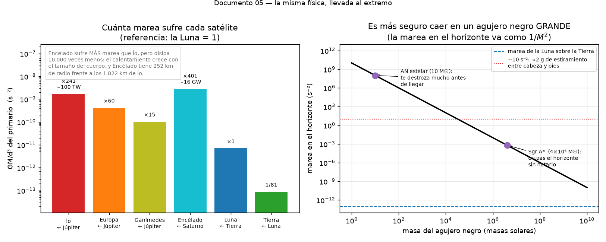

# Mareas en el resto del universo

En la Tierra la marea mueve el agua medio metro. Llevada al extremo, la misma
física funde lunas enteras, mantiene océanos líquidos a 800 millones de kilómetros
del Sol, destroza cometas y desgarra estrellas.

Todo con el mismo `GM/d³` del que hablamos en
[04-por-que-la-luna-gana-al-sol.md](04-por-que-la-luna-gana-al-sol.md).



---

## Ío: el cuerpo más volcánico del sistema solar

Ío, la luna interior de Júpiter, tiene **más de 400 volcanes activos** y erupciones
que lanzan penachos a 300 km de altura. Su superficie se renueva tan rápido que no
tiene apenas cráteres de impacto. Disipa del orden de **100 TW** de calor: unas 25
veces toda la energía que consume la humanidad, en una luna algo más pequeña que la
nuestra.

La fuente es la marea de Júpiter. Pero hay un problema conceptual interesante: Ío
está acoplada por marea a Júpiter (le muestra siempre la misma cara), y una luna
acoplada en órbita circular **no se calienta**. El bulto queda fijo, no hay
deformación cíclica, no hay fricción interna. Para calentar hace falta que el bulto
suba y baje.

La órbita de Ío **no es circular**, y no lo es porque no puede.

Ío, Europa y Ganímedes están en una **resonancia de Laplace 1:2:4**: por cada
vuelta de Ganímedes, Europa da dos e Ío cuatro. Los encuentros repetidos con las
otras dos lunas siempre en la misma configuración bombean continuamente la
excentricidad de Ío, contrarrestando la circularización que la marea intentaría
imponer. La excentricidad forzada es pequeña —solo 0.0041— pero suficiente: a lo
largo de cada órbita la distancia a Júpiter cambia, el bulto de marea sube y baja
decenas de metros, y la roca se amasa a sí misma.

Ío se funde porque tiene vecinas. Sin la resonancia, su órbita se haría circular y
se apagaría.

---

## Océanos donde no debería haberlos

**Europa**, la siguiente luna, recibe el mismo tratamiento con menos intensidad. El
resultado no es vulcanismo sino una capa de agua líquida bajo una corteza de hielo:
un océano global de posiblemente 60–150 km de profundidad, con más agua que todos
los océanos terrestres juntos. Y eso a 780 millones de km del Sol, muy fuera de la
zona habitable clásica.

**Encélado**, una luna de Saturno de solo 500 km de diámetro, hace algo aún más
espectacular: la sonda Cassini detectó en 2005 **penachos de vapor de agua y hielo
saliendo por fracturas del polo sur**, y después voló directamente a través de
ellos para analizarlos. Encontró agua salada, sílice y moléculas orgánicas. Un
cuerpo que cabría entre Madrid y Roma está expulsando el contenido de su océano
subterráneo al espacio, y el calor que lo mantiene líquido es marea de Saturno,
mantenida por una resonancia 2:1 con Dione.

La consecuencia conceptual es grande: **el calentamiento de marea amplía
enormemente dónde puede haber agua líquida**. La zona habitable clásica se define
por la distancia a la estrella, pero una luna con una vecina resonante puede tener
océano donde el Sol es un punto brillante. Los objetivos más prometedores para
buscar vida en el sistema solar no están en la zona habitable: son Europa y
Encélado.

---

## El límite de Roche: cuando la marea te destroza

Si un cuerpo se acerca demasiado, la marea supera a su propia gravedad y lo
desarma. Ese umbral es el **límite de Roche**, y para un cuerpo fluido está en

```
d ≈ 2.44 R_planeta (ρ_planeta / ρ_satélite)^(1/3)
```

Dos consecuencias visibles:

- **Los anillos de Saturno están dentro del límite de Roche.** No son una luna
  porque no *pueden* serlo: a esa distancia la marea de Saturno impide que el
  material se agregue. Los anillos no son los restos de una luna destruida
  necesariamente, sino material que nunca pudo juntarse.
- **El cometa Shoemaker-Levy 9** pasó demasiado cerca de Júpiter en 1992 y se
  partió en más de 20 fragmentos, que se alinearon como un "collar de perlas". Dos
  años después, en julio de 1994, se estrellaron uno tras otro contra Júpiter,
  dejando cicatrices del tamaño de la Tierra visibles con telescopios de
  aficionado. Fue el primer impacto planetario observado en directo por la
  humanidad, y la causa de su fragmentación fue puramente mareal.

---

## Espaguetificación, y una paradoja bonita

Cerca de un agujero negro, la marea te estira en la dirección radial y te comprime
lateralmente. Es el mismo elipsoide de los dos bultos, llevado al límite. El
término técnico informal es *espaguetificación*.

Y aquí hay una paradoja que resulta ser instructiva: **es más seguro caer en un
agujero negro grande que en uno pequeño**.

La marea en el horizonte de sucesos va como GM/d³, y el radio del horizonte va como
d ∝ GM/c². Sustituyendo:

```
marea en el horizonte  ∝  GM/(GM)³  =  1/(GM)²
```

Cuanto más masivo el agujero negro, **más suave** la marea en su horizonte. En un
agujero negro estelar de 10 masas solares la marea te mataría miles de kilómetros
antes de llegar al horizonte. En el agujero negro supermasivo del centro de nuestra
galaxia, de 4 millones de masas solares, cruzarías el horizonte entero sin notar
nada especial. Lo cual no ayuda mucho, pero es un buen ejemplo de cómo un
exponente cambia la intuición.

A escala astronómica esto se observa: los **eventos de disrupción mareal** (*tidal
disruption events*) ocurren cuando una estrella pasa demasiado cerca de un agujero
negro supermasivo y es desgarrada. Aproximadamente la mitad del material sale
despedido y la otra mitad forma un disco que se traga en meses, produciendo un
fogonazo que se detecta a cientos de millones de años luz. Se descubren varios al
año.

---

## Y en la Tierra, dos mareas que se olvidan

**La marea sólida.** La roca de la Tierra también se deforma: el suelo bajo tus
pies sube y baja unos **30 cm** dos veces al día. No lo notas porque todo tu
entorno sube contigo, incluido el nivel del mar de referencia. Pero es perfectamente
medible, y hay que corregirla en GPS de precisión, en interferometría VLBI y en los
detectores de ondas gravitacionales. En este proyecto aparece como el factor de Love
γ₂ = 1 + k₂ − h₂ ≈ 0.693 (`tide/constants.py`), que reduce la marea observable un
31% precisamente porque el suelo se mueve con el agua.

**La marea atmosférica.** La atmósfera también tiene mareas, pero con una sorpresa:
las dominantes **no son gravitatorias**, son térmicas. El calentamiento solar diario
bombea la atmósfera mucho más fuerte que la gravedad de la Luna, y produce una
oscilación de presión con período de 12 h solares que supera a la gravitatoria. Por
eso el constituyente anual Sa que sale en `05_constituents.py` con 0.6 mm de
amplitud es correcto para la gravedad pero irrelevante en un mareógrafo real: allí
Sa está dominado por meteorología —viento, presión, dilatación térmica estacional
del agua— y llega a decenas de centímetros.

---

## Para leer más

Ver [bibliografia.md](bibliografia.md). Para este capítulo:

- **Murray & Dermott, *Solar System Dynamics*** (1999) para resonancias y
  calentamiento de marea, con rigor.
- Las páginas de misión de **Galileo**, **Cassini-Huygens** y **Juno** (NASA/ESA)
  tienen material divulgativo excelente y de dominio público sobre Ío, Europa y
  Encélado.
- **Peale, Cassen & Reynolds (1979)**, "Melting of Io by tidal dissipation",
  *Science* **203**, 892. Predijeron el vulcanismo de Ío por calentamiento de marea
  y se publicó **días antes** de que la Voyager 1 sobrevolara y lo confirmara. Uno
  de los mejores ejemplos de predicción teórica confirmada en planetología.
