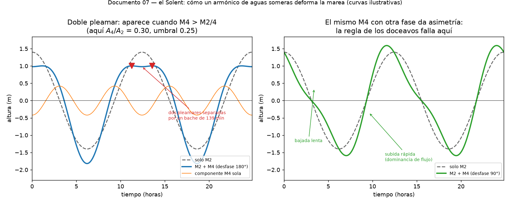

# El Solent: el mejor caso de estudio de mareas del mundo

> **Aviso de navegación.** Este documento explica la *física* del Solent. Para
> navegar de verdad hacen falta las publicaciones oficiales: el **Reeds Nautical
> Almanac**, las **Admiralty Tide Tables**, el atlas de corrientes del Solent y
> las cartas. Nada de lo que hay aquí sustituye a eso, y los valores numéricos
> que doy son aproximados y de memoria: compruébalos siempre en el almanaque del
> año en curso.



Si tuvieras que elegir un sitio en el planeta para entender por qué la marea real
no se parece a la teoría, elegirías el Solent. Tiene, a la vez:

- **doble pleamar** en Southampton, una curva de marea que ni siquiera se parece a
  una sinusoide;
- **dos entradas** —a este y oeste de la Isla de Wight— con ondas de marea que
  interfieren;
- **corrientes muy fuertes** en pasos estrechos, hasta 4-5 nudos en vivas;
- y consecuencias históricas y económicas reales.

Todo lo del documento [06](06-de-la-teoria-al-puerto.md), concentrado en 30 millas.

---

## Lo raro: la doble pleamar de Southampton

En la mayoría de los puertos la marea sube unas 6 horas y baja otras 6. En
Southampton la pleamar **se queda**: hay un período largo de agua alta, de en
torno a dos horas, y en muchos estados de marea aparecen literalmente **dos
crestas** separadas por un pequeño descenso.

La causa es el constituyente **M4**, el armónico de aguas someras del que habla el
documento 06. Recuerda que M4 **no existe en el forzamiento gravitatorio**: lo
genera la propia no linealidad del agua poco profunda, y por eso este proyecto no
lo produce ni podría producirlo.

El mecanismo se ve con álgebra de bachillerato. Toma la marea semidiurna más su
armónico en oposición de fase:

```
η(θ) = A₂ cos θ − A₄ cos 2θ
```

Derivando e igualando a cero:

```
dη/dθ = −A₂ sen θ + 2A₄ sen 2θ = sen θ (4A₄ cos θ − A₂)
```

Hay ceros donde `sen θ = 0` —la pleamar y la bajamar habituales— y **además**
donde `cos θ = A₂/(4A₄)`. Esa segunda solución solo existe si:

```
A₄ > A₂ / 4
```

Es decir: **en cuanto el armónico M4 supera un cuarto de la amplitud de M2, la
pleamar se desdobla.** La figura de arriba usa A₂ = 1.4 m y A₄ = 0.42 m (razón
0.30, por encima del umbral 0.25) y ahí están las dos crestas, separadas unas dos
horas.

En el Solent esa razón es anormalmente alta, y de ahí la curva. La otra mitad de la
figura muestra qué pasa con el mismo M4 en otra fase: en vez de desdoblarse, la
curva se vuelve **asimétrica**, con subida rápida y bajada lenta. Es la misma
física que produce los macareos del Severn.

### Por qué el Solent tiene tanto M4

Dos razones que se refuerzan:

1. **La Isla de Wight crea dos entradas.** La onda de marea del Canal de la Mancha
   entra por el oeste (las Needles / Hurst) y por el este (Spithead / el Nab), y las
   dos se encuentran dentro. Dos ondas que llegan por caminos de longitud distinta
   interfieren, y la interferencia distorsiona la forma de la curva.
2. **Es muy somero y de geometría complicada.** Southampton Water es un valle
   fluvial ahogado, con bajos como el Bramble Bank en medio. La no linealidad de
   aguas someras —`c = √(g(h+η))`, la cresta viaja más rápido que el seno— es
   fuerte precisamente donde h es pequeña.

No es exclusivo de Southampton: **Poole** y la zona de **Christchurch** también
tienen doble pleamar, y **Portsmouth** presenta un *young flood stand*, una parada
en la parte inicial de la creciente.

---

## La consecuencia histórica: por qué Southampton y no otro puerto

Esto es lo que más me gusta del Solent, porque es física convertida en economía.

Una pleamar que se queda dos horas es un regalo para un puerto comercial. Los
grandes buques solo pueden entrar, atracar y salir cerca del agua alta, y en la
mayoría de los puertos esa ventana es estrecha. En Southampton es amplia.

Por eso Southampton se convirtió en el puerto de los transatlánticos británicos, en
lugar de Liverpool o Londres. El *Titanic* zarpó de Southampton el 10 de abril de
1912, y sigue siendo hoy el principal puerto de cruceros del Reino Unido. La razón
última es que la razón A₄/A₂ en Southampton Water pasa de 0.25.

---

## Lo que importa de verdad a bordo: las corrientes

La carrera de marea del Solent es moderada —del orden de 4 m en vivas y 2 m en
muertas en Portsmouth y Southampton— pero **las corrientes son el problema y la
oportunidad**.

- **Hurst Narrows / Needles Channel** (entrada oeste): el paso se estrecha
  muchísimo y la corriente llega a unos **4-5 nudos** en vivas. Con corriente
  saliente y mar de fondo del suroeste, la zona del **Bridge** y el banco de
  Shingles se pone realmente mala: la clásica situación de viento contra corriente
  sobre un bajo.
- **Spithead y el este**: menos extremo, pero con corrientes que hay que planificar.
- Dentro del Solent las corrientes son complejas, con contracorrientes locales
  aprovechables si conoces la zona.

Y aquí es donde se aplica el aviso del documento 06: **el máximo de corriente no
coincide con la pleamar**, y la relación entre altura y corriente es local. Por eso
los atlas de corrientes se refieren a la hora de pleamar de un puerto patrón
—Portsmouth para esta zona— y hay que consultarlos, no deducirlos.

La estrategia normal de un velero es usar la marea como puerta: entrar por las
Needles con la corriente entrante, salir con la saliente. Con 4-5 nudos de
corriente y un barco que hace 6, equivocarse de hora no es una molestia, es la
diferencia entre avanzar y no avanzar.

---

## La regla de los doceavos NO funciona aquí

La regla de los doceavos —que la marea sube 1/12, 2/12, 3/12, 3/12, 2/12, 1/12 de
su carrera en cada una de las seis horas— es una aproximación a una **sinusoide**
con período de 6 horas de subida.

En el Solent la curva no es una sinusoide ni de lejos, como muestra la figura. La
regla puede errar decenas de centímetros, y en el momento equivocado. Por eso las
Admiralty Tide Tables publican **curvas de marea específicas** para Southampton y
Portsmouth en lugar de la curva estándar, y hay que interpolar sobre ellas.

Si tienes poca agua bajo la quilla en el Solent, usa la curva del almanaque, no los
doceavos. Es exactamente el tipo de error que la física de este documento predice.

---

## Cómo conectar esto con el código del proyecto

El Solent es el ejemplo perfecto de la frontera del proyecto:

| | |
|---|---|
| **Los períodos** de M2, S2, N2, K1... | los da este proyecto, exactos |
| **El ciclo de vivas y muertas** de 14.77 d | lo da este proyecto |
| **La amplitud y fase** en Portsmouth | dato empírico, del almanaque |
| **El armónico M4** que desdobla la pleamar | dinámica del océano, no gravedad |

Un ejercicio muy bonito, si te apetece cerrar el círculo: coge las constantes
armónicas publicadas de Portsmouth o Southampton (amplitud y fase de cada
constituyente), mételas en `05_constituents.py:reconstruct()` en lugar de las
nuestras de equilibrio, y predice la marea de un día concreto. El motor ya está
escrito; solo hay que cambiar los números de entrada. Y verás aparecer la doble
pleamar sola, en cuanto incluyas M4 con su fase real.

Ese es, en el fondo, todo el proyecto en una frase: **la astronomía te da el reloj;
el océano y el almanaque te dan la amplitud.**

---

## Para leer

- **Reeds Nautical Almanac** — la referencia práctica para aguas británicas, con
  las curvas de Southampton y Portsmouth y los datos de corrientes.
- **Admiralty Tide Tables**, volumen del NW Europe, y el atlas de corrientes de
  marea del Solent (UKHO). Y **Admiralty EasyTide** para consulta rápida en línea.
- **Pugh & Woodworth, *Sea-Level Science*** para la teoría de los constituyentes de
  aguas someras y por qué aparecen M4 y M6. Ver
  [bibliografia.md](bibliografia.md).
- Cualquier guía de navegación del Solent (las de la RYA o las pilot guides de la
  zona) para las horas concretas de las puertas de marea, que es lo que de verdad
  vas a usar.

Buen viento. Y sal por las Needles con la corriente a favor.
