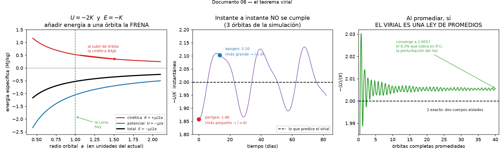

# El teorema virial

Para una órbita gravitatoria, la energía cinética y la potencial no son
independientes. Están amarradas:

```
2⟨K⟩ = −⟨U⟩
```

De ahí sale el resultado que descoloca a todo el mundo en
[02-la-luna-se-aleja.md](02-la-luna-se-aleja.md): **añadir energía a una órbita
la frena**. Y de ahí salió, en 1933, el descubrimiento de la materia oscura.



---

## Lo primero: NO sale de la conservación de la energía

Es la suposición natural, y es incorrecta. La energía no aparece en ningún paso
de la demostración.

El teorema virial sale de dos ingredientes, y solo dos:

1. **La segunda ley de Newton**, `ṗ = F`.
2. Que el sistema esté **acotado** — que no se escape ni colapse.

Hay tres formas de convencerse de que la energía no es la fuente:

**Primera: no aparece.** Lo verás en la deducción de la sección siguiente. Solo
se usa `ṗ = F` y la regla del producto.

**Segunda: el virial sigue valiendo en sistemas que disipan energía.** Este es el
argumento decisivo, y es justo nuestro caso. El sistema Tierra-Luna está
perdiendo 3.5 TW en forma de calor: la energía ahí **no se conserva**. Y sin
embargo la relación `U = −2K` se cumple en cada época. Si el teorema dependiera de
la conservación de la energía, la disipación lo rompería.

Y es precisamente eso lo que nos autoriza a razonar sobre la evolución secular:
podemos decir "si `a` sube, `K` baja" *aunque haya fricción*. **El virial son los
rieles; la fricción es lo que hace que el sistema se deslice por ellos.**

**Tercera: son afirmaciones independientes, y hacen falta las dos.**

| relación | de dónde viene |
|---|---|
| `E = K + U` | definición, más conservación de la energía |
| `2⟨K⟩ = −⟨U⟩` | **el virial** (Newton II + acotación) |
| `E = −⟨K⟩` y `E = ⟨U⟩/2` | de combinar **las dos anteriores** |

La energía entra al deducir las *consecuencias*, no el teorema. Lo que produce el
resultado contraintuitivo —`E = −K`— es el cruce de ambas cosas.

---

## De dónde sale: la identidad de Lagrange-Jacobi

Define el **momento de inercia polar** del sistema respecto al origen:

```
I = Σ mᵢ rᵢ²
```

Piensa en `I` como "el tamaño del sistema, al cuadrado". Deriva dos veces:

```
dI/dt   = 2 Σ mᵢ rᵢ·ṙᵢ = 2 Σ pᵢ·rᵢ
d²I/dt² = 2 Σ (ṗᵢ·rᵢ + pᵢ·ṙᵢ) = 2 Σ Fᵢ·rᵢ + 4K
```

En el segundo paso he usado `ṗ = F` para el primer término, y
`Σ pᵢ·ṙᵢ = Σ mᵢvᵢ² = 2K` para el segundo. Reordenando:

```
½ d²I/dt² = 2K + Σ F·r
```

Esta es la **identidad de Lagrange-Jacobi**. Es **exacta** y **instantánea**: no
hay promedios, no hay aproximaciones, no hay conservación de la energía.

Para la gravedad, `F·r = (−GMm/r²)(r) = −GMm/r = U`, así que:

```
½ d²I/dt² = 2K + U
```

### Verificada con nuestros propios datos

Sobre la órbita Tierra-Luna de la simulación de este proyecto, comparando los dos
lados de la identidad instante a instante:

| lado derecho usado | error relativo | correlación |
|---|---|---|
| `2K + U` (solo dos cuerpos) | 1.5 × 10⁻¹ | 0.990 |
| `2K + U + f·r` (con el Sol) | **1.2 × 10⁻⁶** | **1.0000000** |

donde `f` es la aceleración perturbadora del Sol sobre la órbita relativa. Con el
tercer cuerpo incluido, la identidad se cumple a una parte en un millón, que es
el error del integrador. No es una aproximación: es una identidad
mecánica.

---

## El teorema: promediar en el tiempo

Ahora viene el único paso adicional. Si el sistema está **acotado**, `I` oscila
pero no crece sin límite. Una cantidad acotada no puede tener una segunda derivada
con promedio distinto de cero durante mucho tiempo, así que:

```
⟨d²I/dt²⟩ = 0
```

y por tanto:

```
2⟨K⟩ + ⟨U⟩ = 0        →        2⟨K⟩ = −⟨U⟩
```

Eso es el teorema virial. Y fíjate en lo que significa físicamente:

> **El teorema virial dice, literalmente, que el tamaño del sistema no se está
> acelerando.**

Es una afirmación sobre geometría y escala. Por eso a un sistema que la cumple se
le llama **virializado**: ha tenido tiempo de asentarse.

---

## Es una LEY DE PROMEDIOS. Esto no es un detalle

Aquí es donde casi todo el mundo se despista, así que vale la pena insistir con
datos. `U = −2K` **no se cumple en cada instante** de una órbita elíptica.

Medido sobre la órbita real de nuestra simulación:

| | `d²I/dt²` | `−U/K` medido | qué predice la identidad |
|---|---|---|---|
| **perigeo** | +1.9 × 10⁵ | **1.858** | `I` mínimo → `d²I/dt² > 0` → `−U/K < 2` ✓ |
| **apogeo** | −7.2 × 10⁴ | **2.103** | `I` máximo → `d²I/dt² < 0` → `−U/K > 2` ✓ |
| **promedio, 40 órbitas** | ≈ 0 | **2.0056** | acotado → virial ✓ |

Ni en el perigeo ni en el apogeo sale 2. Se desvía un 7% en cada sentido. Y los
**signos de las desviaciones** los predice la identidad exactamente: en el perigeo
el sistema está en su punto más pequeño, así que su "tamaño" está acelerándose
hacia arriba, y eso empuja el cociente por debajo de 2.

Esto es lo que me convence de que la identidad de Lagrange-Jacobi es el origen
verdadero y no una curiosidad: **explica las desviaciones, no solo el promedio**.
Un teorema deducido de la conservación de la energía no te daría nada de eso.

En una órbita **circular** sí se cumple instantáneamente, pero solo porque ahí
nada varía: `I` es constante, `d²I/dt² = 0` siempre. La órbita circular es el caso
degenerado, y por desgracia es el que sale en los libros de texto, lo que hace
creer que el teorema es instantáneo.

### Un detalle técnico que se cuela

El teorema es sobre el **cociente de los promedios**, `−⟨U⟩/⟨K⟩`, no sobre el
**promedio del cociente**, `⟨−U/K⟩`. No son lo mismo, y el segundo no vale 2. El
panel derecho de la figura calcula el primero.

Y ese 0.0056 que sobra respecto a 2 no es ruido numérico: es `⟨f·r⟩`, la
perturbación del Sol, identificada y medida. Con dos cuerpos aislados saldría 2
exacto.

---

## La forma general, y las condiciones

La versión completa: si el potencial es una **función homogénea de grado `n`** en
las coordenadas (`U ∝ rⁿ`), entonces por el teorema de Euler `Σ F·r = −nU`, y:

```
2⟨K⟩ = n⟨U⟩
```

Dos comprobaciones que dan confianza:

| sistema | `U` | `n` | resultado |
|---|---|---|---|
| gravedad (y Coulomb) | `∝ r⁻¹` | −1 | `2⟨K⟩ = −⟨U⟩` |
| oscilador armónico, resorte | `∝ r²` | +2 | `⟨K⟩ = ⟨U⟩` |

Y el segundo es verdad y se comprueba en cualquier laboratorio: en un muelle
oscilando, la energía se reparte al 50% entre cinética y potencial. El mismo
teorema da el factor 2 para la gravedad y el factor 1 para un resorte, cambiando
solo un exponente.

### Las condiciones, explícitas

Para que `2⟨K⟩ = n⟨U⟩` valga hacen falten:

1. **Sistema acotado.** Si se escapa o colapsa, `I` no está acotado y
   `⟨d²I/dt²⟩ ≠ 0`. Un sistema hiperbólico no obedece el virial.
2. **Promediar sobre tiempo suficiente.** Idealmente un número entero de períodos,
   o mucho más que el tiempo de cruce del sistema. Sobre media órbita el resultado
   no significa nada.
3. **Estado estacionario ("virializado").** El sistema tiene que haber tenido
   tiempo de asentarse. Un cúmulo en pleno choque, o una nube en colapso, **no
   cumple el virial** — y esto tiene consecuencias prácticas graves, ver más abajo.
4. **Potencial homogéneo de grado `n`**, para poder escribir `Σ F·r = −nU`. Si
   mezclas potenciales (gravedad más un resorte) hay que tratar cada término.
5. **Sin fuerzas externas netas**, o si las hay, incluirlas en `Σ F·r` — que es
   exactamente lo que hicimos con el término solar `f·r`. No es una violación del
   teorema, es un término más.
6. **No relativista.** Hay generalizaciones relativistas, con otros factores.

Fíjate en que **la conservación de la energía no está en la lista**.

---

## Las consecuencias

Combinando el virial con `E = K + U`:

```
E = −⟨K⟩          E = ⟨U⟩/2
```

Y derivando respecto al radio orbital, con `μ = G(M+m)`:

| | | |
|---|---|---|
| `K = +μ/2a` | `dK/da < 0` | **la cinética BAJA al subir** |
| `U = −μ/a` | `dU/da > 0` | la potencial sube, **el doble** |
| `E = −μ/2a` | `dE/da > 0` | la total sube |

`dE = −dK = ½ dU`. De aquí salen cuatro consecuencias aparentemente absurdas y
todas ciertas:

**1. La Luna gana energía y se frena.** Sube de órbita, la potencial sube al doble
de lo que baja la cinética, y su velocidad orbital disminuye unos 5 micrómetros/s
por siglo. Ver [02-la-luna-se-aleja.md](02-la-luna-se-aleja.md).

**2. El rozamiento ACELERA a los satélites.** Mismo álgebra, signo opuesto de
`dE`. Un satélite a 400 km orbita a 7.673 m/s; el rozamiento atmosférico le quita
energía, baja de órbita, y **va más rápido**. Es un efecto real que hay que
modelar en operaciones de la ISS.

**3. Los sistemas autogravitantes tienen capacidad calorífica NEGATIVA.** Si
`E = −K`, entonces al **radiar** energía (bajar `E`) la `K` **sube**: el sistema se
contrae y se **calienta**. Al revés que un gas normal. Por eso una nube de gas que
colapsa se calienta hasta encender la fusión: la gravedad es su propio horno, y no
hace falta nada más para arrancar una estrella.

**4. El mecanismo de Kelvin-Helmholtz.** De `E = U/2`: al contraerse, de la energía
potencial liberada la mitad se radia y la mitad se queda como calor interno. Ese
factor 2 es puro virial. Antes de conocerse la fusión nuclear, este era el
candidato para explicar la energía del Sol — daba una edad de unas decenas de
millones de años, que chocaba de frente con lo que decía la geología. Ese conflicto
fue una de las pistas de que faltaba física por descubrir.

---

## Cómo se descubrió la materia oscura

Esta es la aplicación más famosa del teorema, y es de una economía notable: **el
virial convierte velocidades en masa**.

La idea es que en un cúmulo de galaxias virializado no puedes ver la masa, pero sí
puedes medir cómo se mueven las galaxias. Y el virial te lleva de lo segundo a lo
primero.

Para una esfera uniforme de masa `M` y radio `R`:

```
U = −3GM²/(5R)              K = (3/2) M σ²
```

con `σ` la dispersión de velocidades en la línea de visión (suponiendo isotropía,
`⟨v²⟩ = 3σ²`). Imponiendo `2K = −U`, la `M²` se cancela contra una `M` y queda:

```
M ≈ 5 σ² R / G
```

**Toda la masa del cúmulo, a partir de un espectro y un tamaño angular.**

### El cálculo de Coma, en una servilleta

Fritz Zwicky lo hizo en 1933 con el cúmulo de Coma. Con valores modernos:

```
σ ≈ 1000 km/s        R ≈ 2 Mpc

M ≈ 5 × (10⁶ m/s)² × (6.2 × 10²² m) / 6.674×10⁻¹¹
  ≈ 4.6 × 10⁴⁵ kg
  ≈ 2 × 10¹⁵ masas solares
```

El valor moderno aceptado para Coma es del orden de 10¹⁵ masas solares. **Un
estimador de una línea, y aciertas el orden de magnitud.**

Y aquí está el problema que cambió la astrofísica: la masa estelar visible de las
~1.000 galaxias de Coma es del orden de 10¹³ masas solares. **Falta un factor de
~100.** Zwicky publicó que tenía que haber materia que no se veía, y la llamó
*dunkle Materie*: materia oscura.

### Honestidad sobre lo que Zwicky pudo y no pudo concluir

Sus números concretos estaban bastante mal, sobre todo porque la escala de
distancias de la época era errónea (la constante de Hubble que se usaba en 1933
estaba desviada por casi un orden de magnitud). Pero la conclusión cualitativa
—hace falta mucha más masa de la que emite luz— resistió, y hoy sabemos que en un
cúmulo típico el reparto es aproximadamente:

| componente | fracción de la masa |
|---|---|
| materia oscura | ~85% |
| gas caliente intracumular | ~12% |
| estrellas | ~3% |

Parte del "factor 100" respecto a las estrellas es gas caliente, que Zwicky no
podía ver porque emite en rayos X y no había telescopios de rayos X. Pero ni
sumando el gas se cierra la cuenta: la mayor parte sigue siendo oscura.

La confirmación llegó por caminos independientes: las **curvas de rotación de
galaxias** de Vera Rubin y Kent Ford en los años 70 (un método completamente
distinto, a escala de galaxia y no de cúmulo), la emisión de **rayos X** del gas
caliente, y las **lentes gravitatorias**.

### La condición que hay que vigilar

Recuerda la condición 3 de la lista: el sistema tiene que estar **virializado**.
Si un cúmulo está en pleno choque, no lo está, y el estimador virial da una masa
equivocada.

El ejemplo canónico es el **Cúmulo Bala** (*Bullet Cluster*), dos cúmulos
atravesándose. Ahí el virial no se puede aplicar sin más, y hay que medir la masa
con **lentes gravitatorias** y el gas con **rayos X**. Precisamente por eso el
Cúmulo Bala se volvió famoso: al separarse el gas de la masa gravitatoria durante
la colisión, se ve directamente que la mayor parte de la masa no es el gas.

De este teorema viene todo un vocabulario que se usa a diario en cosmología:
**masa virial**, **radio virial** (el `R₂₀₀` dentro del cual la densidad media es
200 veces la crítica), **temperatura virial**.

---

## Qué hace y qué no hace este proyecto

Conviene separarlo bien, porque no es lo mismo:

| | |
|---|---|
| **La relación virial** `U = −2K` | **SÍ está** en nuestra simulación, medida a 0.3%, y el residuo identificado como la perturbación solar |
| **La identidad de Lagrange-Jacobi** | **SÍ**, verificada a 1.2 × 10⁻⁶ |
| **La evolución secular** (que la Luna suba de verdad) | **NO** — requiere disipación, y nuestro modelo es conservativo |

Es la distinción del principio: tenemos los rieles, no el motor. Nuestra
simulación conserva la energía a 8.7 × 10⁻¹³ en 20 años, y esa es a la vez la razón
de que los períodos de marea salgan bien y la razón de que la Luna no se aleje ni
un milímetro.

---

## Para leer más

Ver [bibliografia.md](bibliografia.md). Para este tema en concreto:

- **Goldstein, *Classical Mechanics***, o cualquier libro de mecánica clásica de
  nivel intermedio, para la deducción general y el teorema de Euler sobre
  funciones homogéneas.
- **Binney & Tremaine, *Galactic Dynamics*** (2ª ed., 2008). *El* libro para el
  virial aplicado a sistemas estelares, con el tensor virial completo (la versión
  con índices, que es más potente que la escalar de aquí). Nivel de posgrado.
- **Zwicky (1933)**, "Die Rotverschiebung von extragalaktischen Nebeln",
  *Helvetica Physica Acta* **6**, 110. El artículo original. Y su versión en
  inglés de 1937 en el *Astrophysical Journal*, más accesible.
- **Rubin & Ford (1970)** sobre la curva de rotación de M31, la confirmación
  independiente desde una escala completamente distinta.
