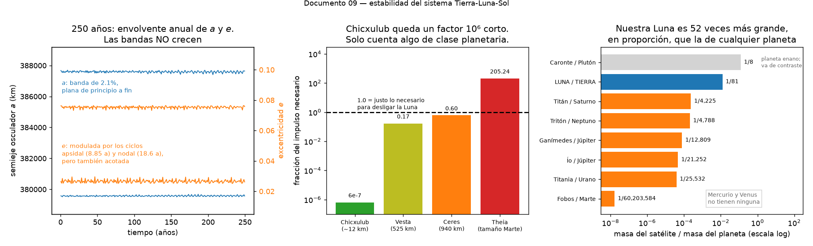

# ¿Cuán estable es el sistema Tierra-Luna-Sol?

La intuición razonable es esta: no puede ser un milagro que el sistema esté aquí.
Debe ser robusto frente a perturbaciones —impactos de meteoritos y cosas así—
porque si fuera fácil de desarmar, ya se habría desarmado.

La primera parte es **correcta**, y se puede cuantificar de forma contundente. La
segunda es un **salto lógico** que conviene deshacer: la robustez explica que el
sistema **siga aquí**, no que **se formara**. Y eso es interesante, porque todo
apunta a que la formación fue un accidente bastante improbable.



---

## Qué tan profundo es el pozo

Primero una medida de contexto. El **radio de Hill** de la Tierra —la distancia
hasta donde la gravedad terrestre domina sobre la del Sol— es de unos **1.5
millones de km**.

| | distancia | % del radio de Hill |
|---|---|---|
| la Luna, hoy | 384.400 km | **26%** |
| sincronización final | ~550.000 km | 37% |
| límite práctico de estabilidad | | 33–50% |

La Luna está bien dentro del pozo, con margen. No está al borde de nada.

---

## Cuánto costaría desarmarlo

Para desligar la Luna hace falta llevarla de su velocidad orbital a la de escape:

```
v orbital  = 1.025 m/s
v escape   = 1.449 m/s
Δv         =   424 m/s     (+41%)
```

Un 41% más de velocidad. ¿Qué impacto haría eso? Con un cuerpo entrando a 20 km/s,
**tangencialmente y perfectamente alineado** —o sea, en el caso más favorable
imaginable:

| impactor | masa | fracción del impulso necesario |
|---|---|---|
| Chicxulub (el de los dinosaurios, ~12 km) | 10¹⁵ kg | **6 × 10⁻⁷** |
| Vesta (525 km) | 2.6 × 10²⁰ kg | 0.17 |
| **Ceres** (940 km, el mayor asteroide) | 9.4 × 10²⁰ kg | **0.60** |
| Theia (tamaño de Marte) | 6.4 × 10²³ kg | 205 |

Léelo despacio: **Chicxulub, que reorganizó la biosfera entera, es un millonésimo
de lo necesario para perturbar apreciablemente la órbita lunar.** En energía la
comparación es igual de brutal: liberó ~2 × 10²³ J frente a los 3.8 × 10²⁸ J de
energía de ligadura de la órbita — cinco órdenes de magnitud corto.

Ni siquiera Ceres bastaría, y Ceres está en el cinturón principal, no en una órbita
que cruce la Tierra. Para frenar la rotación terrestre haría falta algo de
4.6 × 10²² kg, un 0.77% de la masa de la Tierra: el 62% de la masa lunar.

Y de ahí sale una simetría que me parece el mejor resumen del asunto:

> **Lo único capaz de desarmar el sistema Tierra-Luna es exactamente la misma clase
> de evento que lo creó.**

---

## La prueba numérica, con nuestro propio código

Las cuentas de arriba son estimaciones de sobremesa. Pero la estabilidad frente a
la perturbación que *sí* actúa continuamente —el Sol— se puede medir directamente
integrando.

Integrando el sistema **1.500 años** con paso de media hora (267 s de cómputo):

| | primeros 20 años | los 1.500 años completos |
|---|---|---|
| semieje osculador `a` | 379.526 – 387.698 km | **379.511 – 387.704 km** |
| excentricidad `e` | 0.0251 – 0.0762 | **0.0250 – 0.0766** |
| distancia Tierra-Luna | 356.847 – 406.289 km | **356.705 – 406.352 km** |

con una deriva de energía de **3.5 × 10⁻¹¹** en los 1.500 años.

Lo importante es que **las bandas casi no crecen**. Multiplicando el tiempo de
integración por 75, la anchura de la banda de `a` crece un **0.26%** y sus extremos
se mueven un 0.004%. El ajuste lineal da una deriva de **−40 m por milenio** sobre
un semieje de 383.372 km: una parte en 10⁷, indistinguible de cero al nivel de
precisión del propio ajuste.

No hay deriva secular. El semieje oscila alrededor de su media y **vuelve**, una y
otra vez, y la excentricidad hace lo mismo, modulada por los ciclos apsidal de 8.85
años y nodal de 18.6 años que ya medimos en
[02-la-luna-se-aleja.md](02-la-luna-se-aleja.md).

Esa es exactamente la firma de un sistema **acotado y cuasi-periódico**, que es lo
que significa "dinámicamente estable". Mil quinientos años no prueban nada sobre
eones —el caos tarda mucho más en manifestarse— pero el comportamiento cualitativo
es el correcto, y es un resultado nuestro y no una cita.

Puedes reproducirlo subiendo `STABILITY_YEARS` en
`docs/make_figures.py` (por defecto 250 años, que tarda unos 40 segundos).

---

## El salto lógico: persistencia no es formación

Aquí está el punto fino. "Si fuera frágil no se habría formado" mezcla **dos
preguntas distintas**:

| pregunta | respuesta |
|---|---|
| ¿por qué **sigue aquí**? | porque es robusto — cierto, y cuantificado arriba |
| ¿por qué **se formó**? | independiente. Y la respuesta parece ser: por un evento raro |

La robustez explica la **persistencia**. No dice nada sobre la **probabilidad de la
formación**. Y todo apunta a que la formación fue un accidente bastante específico.

### La Luna es un caso atípico, y por mucho

Esta es la evidencia más limpia. Si comparas la masa de cada satélite con la de su
planeta:

| par | razón de masas | |
|---|---|---|
| **Luna / Tierra** | **1 / 81** | |
| Titán / Saturno | 1 / 4.225 | |
| Tritón / Neptuno | 1 / 4.788 | |
| Ganímedes / Júpiter | 1 / 12.809 | *la luna más grande del sistema solar* |
| Ío / Júpiter | 1 / 21.252 | |
| Titania / Urano | 1 / 25.532 | |
| Fobos / Marte | 1 / 60.203.584 | |
| Mercurio, Venus | **ninguna** | |

Nuestra Luna es, en proporción, **52 veces más grande** que la del siguiente planeta
de la lista. No es una diferencia de grado: es otra categoría.

Y no es que la Luna sea la mayor en tamaño absoluto —Ganímedes, Titán, Calisto e Ío
son todos más grandes—. Es que las demás son satélites *pequeños respecto a
planetas enormes*. La Luna tiene un **27% del diámetro terrestre**; Titán tiene un
4% del de Saturno. Lo nuestro no es un planeta con una luna: es casi un **sistema
doble**.

(El único caso comparable es Plutón y Caronte, con 1/8. Pero Plutón es un planeta
enano, y precisamente por eso se cita como sistema binario y no como planeta con
satélite.)

### El choque

La explicación aceptada es la hipótesis del **impacto gigante**: un cuerpo del
tamaño de Marte —llamado Theia— chocó con la proto-Tierra hace unos 4.500 millones
de años, y de los escombros en órbita se acretó la Luna.

Eso no es un proceso genérico que le pase a cualquier planeta. Es un choque con un
rango relativamente estrecho de masas, ángulos y velocidades que funcionan: demasiado
frontal y no queda material en órbita, demasiado rasante y el impactor sigue de
largo, demasiado rápido y todo escapa. Las simulaciones de Canup y Asphaug delimitan
esa ventana.

**Venus, prácticamente un gemelo de la Tierra en masa y composición, no tiene luna
ninguna.** Es el mejor argumento de que no era inevitable.

### El resumen correcto

**Formación rara + persistencia robusta.** Son dos hechos independientes, y solo el
segundo se sigue de la física de este proyecto.

Cuidado además con el sesgo de selección: observamos este sistema porque persistió,
y persistió porque es estable. Ese razonamiento es válido, pero **no te autoriza a
concluir que era probable que se formara**. Solo que, una vez formado, iba a durar.

---

## Una aclaración, para no dejar la puerta abierta

Sabiendo que la Luna se aleja 3.8 cm al año, la conclusión tentadora es que a la
larga se irá. **No es así**, y conviene decirlo aunque sea de pasada porque si no
queda flotando.

El retroceso es **autolimitado**. El par de fuerzas que empuja a la Luna existe solo
porque el bulto de marea está desalineado, y está desalineado solo porque la Tierra
gira más rápido de lo que la Luna orbita. A medida que la Tierra se frena el desfase
se reduce, y cuando el día iguale al mes el par se anula y **el retroceso se
detiene**: un equilibrio, no una fuga. Los detalles están en
[02-la-luna-se-aleja.md](02-la-luna-se-aleja.md).

Y de todas formas es académico: sincronizar requiere unos 50.000 millones de años y
al Sol le quedan 5.000. El final del sistema no lo pone la marea, lo pone el Sol.

---

## Lo que sí es un componente del cuadro: el caos

Merece una mención, no un capítulo. El sistema solar interior es **caótico**, con un
tiempo de Lyapunov de unos 5 millones de años, y en escalas de miles de millones de
años hay una probabilidad pequeña de que las órbitas de los planetas interiores se
desestabilicen (Laskar y Gastineau, 2009).

O sea que la robustez de la que habla este documento es robustez **frente a
perturbaciones externas** —impactos, el tirón del Sol—. Frente a su propia dinámica
interna, integrada durante eones, el sistema no es perfectamente predecible. El caos
es parte del cuadro, y no una nota al pie.

---

## El giro final: la Luna es el estabilizador

Vale la pena invertir el marco con el que empezamos.

Primero una precisión, porque es fácil confundirlo: lo que la Luna estabiliza no es
la **órbita** de la Tierra —su forma y tamaño alrededor del Sol— sino su
**oblicuidad**: la inclinación del eje de rotación. Y resulta que eso es lo que
gobierna el clima.

Hoy la oblicuidad terrestre es notablemente estable: oscila entre 22.1° y 24.5° en
un ciclo de unos 41.000 años. Esa variación pequeña es uno de los ciclos de
Milankovitch, y ya basta para meter y sacar al planeta de las edades de hielo.

**Sin la Luna, esa inclinación vagaría caóticamente.** Laskar, Joutel y Robutel lo
mostraron en 1993, y el mecanismo es bonito: el par lunar sobre el abultamiento
ecuatorial terrestre hace que el eje precese rápido —con período de unos 26.000
años—. Esa frecuencia de precesión queda **lejos de resonancia** con las frecuencias
de las perturbaciones planetarias. Sin la Luna la precesión sería mucho más lenta,
caería dentro de ese enjambre de resonancias, y la oblicuidad se volvería caótica,
con excursiones de decenas de grados.

**Marte es el caso de control**: sin una luna grande, su oblicuidad ha variado
enormemente a lo largo de su historia, del orden de 15° a 45°, y eso ha movido sus
depósitos de hielo entre los polos y las latitudes medias.

Piensa en lo que significaría para la Tierra. La oblicuidad es lo que produce las
estaciones: con inclinación casi nula no habría estaciones y los polos serían
trampas de hielo permanentes; con inclinación muy alta los polos recibirían más
insolación anual que el ecuador, y el planeta alternaría entre hemisferios abrasados
y congelados en cada órbita. No la clase de estabilidad climática en la que evoluciona
una biosfera compleja.

Así que la Luna no es un pasajero al que la Tierra sostiene a duras penas:

> **Es parte de lo que hace estable el clima terrestre.** El sistema no solo es
> robusto — uno de sus componentes es lo que aporta esa robustez al otro.

Y ahí se cierra el círculo con la sección de la formación. Ese estabilizador
climático llegó por un choque improbable, hace 4.500 millones de años, y es el
único de su clase entre los planetas del sistema solar. Es un ingrediente
razonable en la lista de cosas que hicieron habitable este planeta, y no había
ninguna garantía de que fuese a estar.

---

## Qué hace y qué no hace este proyecto

| | |
|---|---|
| Estabilidad acotada frente a la perturbación solar | **SÍ** — medida sobre 1.500 años |
| Ciclos nodal y apsidal acotados y periódicos | **SÍ** — 18.60 y 8.85 años |
| El retroceso lunar, y por tanto su frenado | **NO** — requiere disipación |
| Caos secular en escalas de Ga | **NO** — haría falta integrar todos los planetas durante miles de millones de años |

Lo que este proyecto puede afirmar con sus propios datos es la primera mitad del
argumento: el sistema, tal como lo modelamos, es acotado y cuasi-periódico. La
segunda mitad —el destino a escala de eones— viene de la literatura, y está
señalado como tal.

---

## Para leer más

Ver [bibliografia.md](bibliografia.md). Para este tema:

- **Laskar, Joutel & Robutel (1993)**, "Stabilization of the Earth's obliquity by
  the Moon", *Nature* **361**, 615. El artículo del giro final.
- **Laskar & Gastineau (2009)**, "Existence of collisional trajectories of Mercury,
  Mars and Venus with the Earth", *Nature* **459**, 817. El caos del sistema solar
  interior, con integraciones masivas.
- **Canup & Asphaug (2001)**, "Origin of the Moon in a giant impact near the end of
  the Earth's formation", *Nature* **412**, 708. La simulación de referencia del
  impacto gigante.
- **Touma & Wisdom (1994)**, "Evolution of the Earth-Moon system", *Astronomical
  Journal* **108**, 1943. La historia de marea del sistema integrada hacia atrás.
- **Murray & Dermott, *Solar System Dynamics***, capítulo 3 para esferas de Hill y
  estabilidad de satélites, y capítulo 9 para caos.
