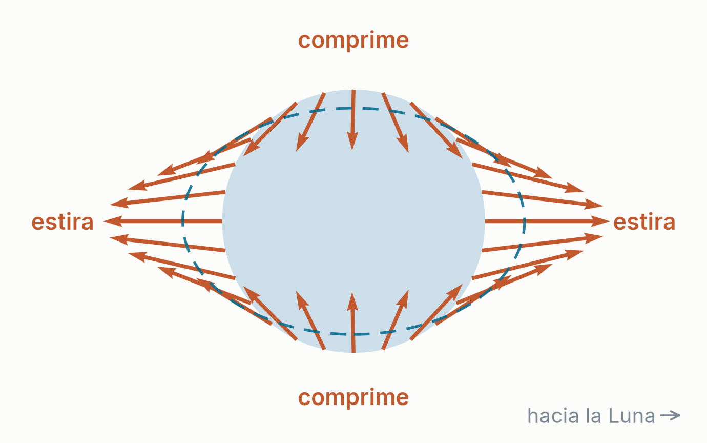
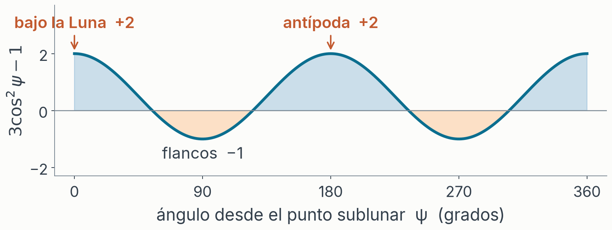
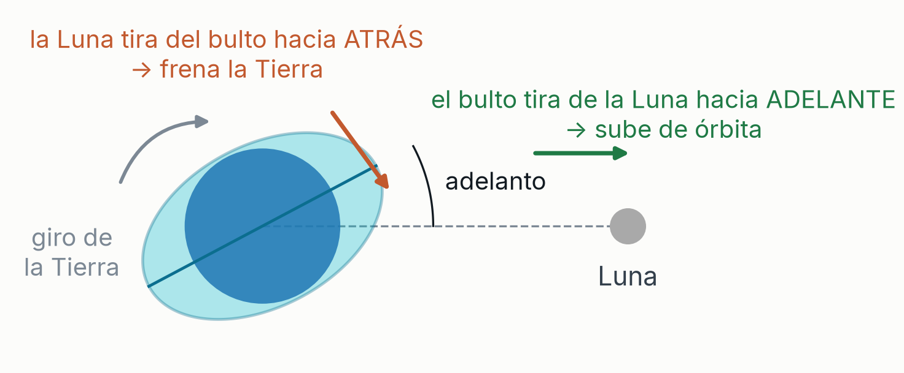
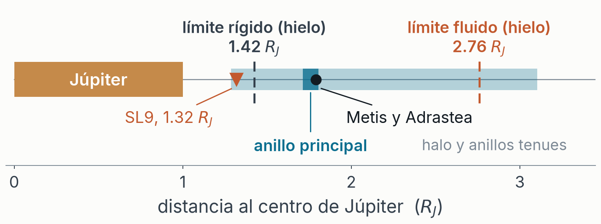
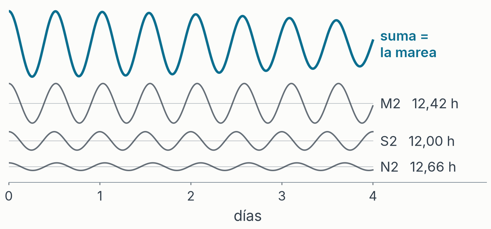
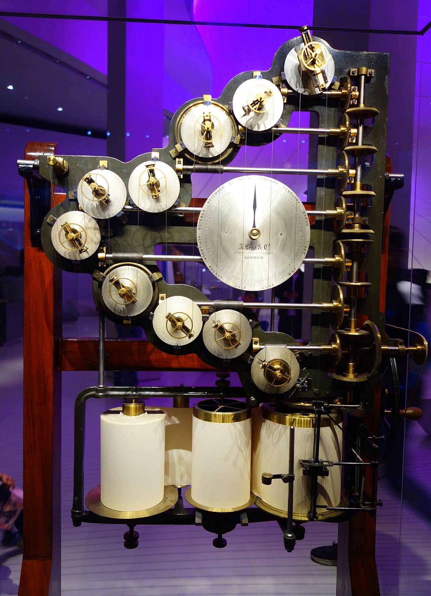
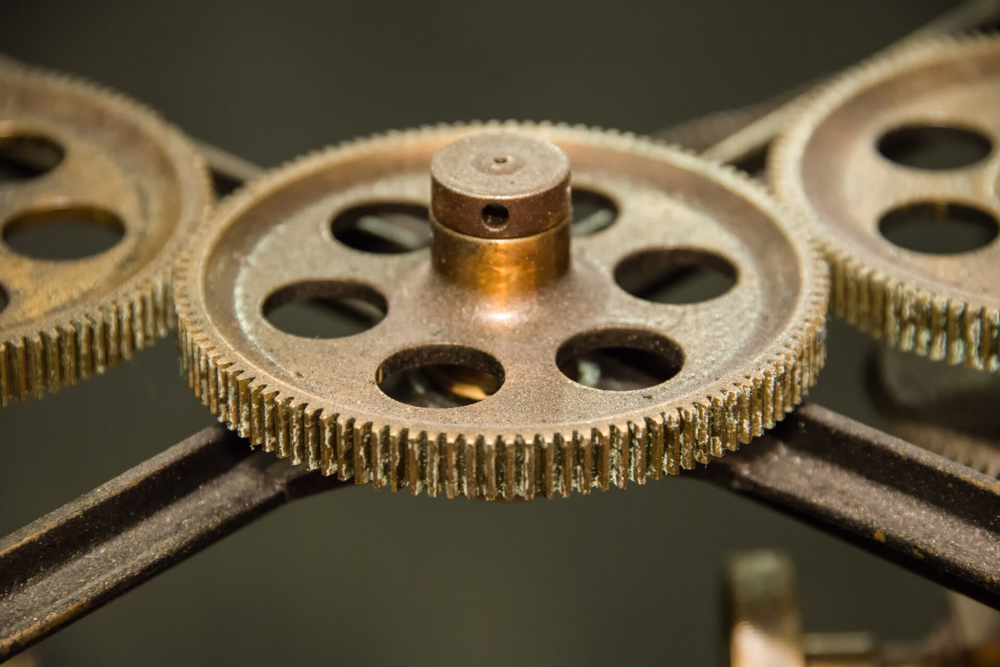

# Quién soy

- Ezequiel
- Soy programador
- Lic. Física, 2005 – 2011
- Me faltan dos materias

---

# Mareas

---

# De dónde sale la marea

## No es la atracción: es la diferencia

- La Luna tira de **todo** a la vez: del agua, de la roca, del planeta entero. Y todo cae hacia ella junto.
- La Tierra está en **caída libre**, y en caída libre la gravedad uniforme es invisible. Sólo se nota lo que *varía* de un punto a otro.
- Potencial de la Luna en una estación $\mathbf{r}$, con la Luna en $\mathbf{d}$:  $\Phi = -GM/|\mathbf{d}-\mathbf{r}|$
- Le quitamos las dos piezas que **no** levantan marea:
  - $-GM/|\mathbf{d}|$: constante en toda la Tierra, y un potencial constante no ejerce fuerza
  - el término **lineal** en $\mathbf{r}$: la caída libre de la Tierra entera, se cancela

### $V(\mathbf{r}) = GM \left( \frac{1}{|\mathbf{d}-\mathbf{r}|} - \frac{1}{|\mathbf{d}|} - \frac{\mathbf{r}\cdot\mathbf{d}}{|\mathbf{d}|^3} \right)$   exacto

---

# Dos bultos, y por qué el Sol pierde

### $V \approx \frac{GM\,r^2}{2d^3}\,(3\cos^2\psi - 1)$   para $r \ll d$

- **Par en $\cos\psi$**: no distingue el lado cercano del lejano. **Dos bultos**: 0° y 180°.
- **$1/d^3$, no $1/d^2$**: el Sol gana 27 millones en masa; la Luna, 59 **al cubo**. **2.18 a 1**.

---

# La Luna se aleja, la Tierra se frena

- La rotación arrastra el bulto **por delante**. Apuntado exacto, el par sería **cero**.
- **El momento angular se conserva**: del giro de la Tierra a la órbita de la Luna.
- **3.8 cm/año** se aleja la Luna; **2.3 ms/siglo** se alarga el día.
- **Virial**: en una órbita $U = -2K$. Gana energía y va **más despacio**.
- Hace 620 millones de años: día de **21.9 h**, año de **400 días**. ¡Eran más cortos!

---

# El límite de Roche: marea contra gravedad propia

Un satélite de masa $m$ y radio $r$, a distancia $d$ de un planeta de masa $M$. Sobre un trozo $\delta m$ de su superficie compiten dos fuerzas:

- Lo que lo **sujeta**, la gravedad del propio satélite: $F_{propia} = G\,m\,\delta m / r^2$
- Lo que lo **arranca**, la marea del planeta: $F_{marea} \approx 2\,G\,M\,\delta m\,r / d^3$

### Se rompe cuando la marea gana: $\frac{Gm}{r^2} = \frac{2GMr}{d^3}$

### $d = r \left( \dfrac{2M}{m} \right)^{1/3}$

---

# El tamaño se cancela: sólo cuentan las densidades

Con $M = \frac{4}{3}\pi R^3 \rho_M$ y $m = \frac{4}{3}\pi r^3 \rho_m$, el radio $r$ del satélite desaparece:

### $d = R \left( \dfrac{2\rho_M}{\rho_m} \right)^{1/3} \approx 1{,}26\, R \left( \dfrac{\rho_M}{\rho_m} \right)^{1/3}$

- Un guijarro y una luna se rompen **a la misma distancia**. No importa el tamaño, sólo lo densos que sean.
- Ese **1,26** vale para un cuerpo rígido. Si se deja deformar, se estira, se alarga y se rompe antes: **2,44**. Es el cálculo de Roche de 1848.
- Para Júpiter y un cuerpo de hielo: **1,42 $R_J$** rígido, **2,76 $R_J$** fluido.

---

# Los anillos de Júpiter y Shoemaker-Levy 9

- El **anillo principal** está en 1,7–1,8 $R_J$, dentro del límite: ahí el material no puede juntarse en una luna.
- **Metis y Adrastea** sobreviven ahí porque son sólidas y densas: para la roca rígida el límite cae dentro del planeta, en 0,96 $R_J$.
- **Shoemaker-Levy 9** pasó a 1,3 $R_J$ el 7 de julio de 1992. Escombros helados: se partió en más de 20 fragmentos, el *collar de perlas*, que cayeron del 16 al 22 de julio de 1994.

---

# La marea es una onda forzada (Laplace, 1776)

## Aguas someras: una capa delgada de profundidad $h$

- La onda de marea mide miles de kilómetros de largo y el océano 4 km de hondo. Con esa desproporción las aceleraciones verticales no cuentan, y el agua se mueve en bloque: la velocidad es la misma a toda profundidad.
- Las incógnitas, en el plano horizontal $(x, y)$:
  - $\eta(x,y,t)$: la elevación de la superficie sobre el nivel de reposo
  - $\mathbf{u}(x,y,t) = (u, v)$: la velocidad horizontal del agua
- Lo que sabemos: $g$, la profundidad $h$, y el potencial generador $V(x,y,t)$ de la lámina 3, con el convenio $\eta_{eq} = V/g$ para la marea de equilibrio.

---

# Las dos ecuaciones

### Movimiento (Newton):   $\dfrac{\partial \mathbf{u}}{\partial t} + f\,\hat{\mathbf{k}} \times \mathbf{u} = -g\,\nabla \left( \eta - \dfrac{V}{g} \right)$

- El agua acelera por el gradiente de presión, que viene de $\eta$, y por la marea de equilibrio $V/g$. Con $\eta = \eta_{eq}$ el paréntesis se anula y no hay fuerza neta: el equilibrio de Newton.
- $f = 2\Omega \sin\varphi$ es el término de Coriolis. Sin fricción, y sin los términos no lineales: la corriente de marea es de ~1 m/s y la onda viaja a ~200 m/s.

### Continuidad (masa):   $\dfrac{\partial \eta}{\partial t} + \nabla \cdot (h\,\mathbf{u}) = 0$

- La superficie sube donde el flujo converge. Con $\eta \ll h$ —centímetros contra kilómetros— se usa $h$ y no $h + \eta$.

---

# Eliminar $\mathbf{u}$

- Para ver la estructura de la onda tomo $h$ constante y $f \approx 0$. Desaparece Coriolis, y con él los puntos anfidrómicos, que son un efecto de la rotación.

### Paso 1. Abro el gradiente en el movimiento

### $\dfrac{\partial \mathbf{u}}{\partial t} = -g\,\nabla \eta + \nabla V$

- $\nabla V$ es una fuerza externa por unidad de masa, aplicada al agua directamente.

### Paso 2. Divergencia de los dos lados

### $\dfrac{\partial}{\partial t}\left( \nabla \cdot \mathbf{u} \right) = -g\,\nabla^2 \eta + \nabla^2 V$

- Las derivadas en $t$ y en el espacio conmutan, y $\nabla^2 = \partial_x^2 + \partial_y^2$.

---

# Sustituir la continuidad

### Paso 3. Derivo la continuidad respecto de $t$

### $\dfrac{\partial^2 \eta}{\partial t^2} + h\,\dfrac{\partial}{\partial t}\left( \nabla \cdot \mathbf{u} \right) = 0$

- Y ahí aparece la misma cantidad que en el paso 2.

### Paso 4. Igualo las dos expresiones de $\partial_t (\nabla \cdot \mathbf{u})$

### $-\dfrac{1}{h}\,\dfrac{\partial^2 \eta}{\partial t^2} = -g\,\nabla^2 \eta + \nabla^2 V$

- Multiplico por $-h$ y paso el término de $\eta$ a la izquierda.

---

# La ecuación de onda forzada

### $\dfrac{\partial^2 \eta}{\partial t^2} - c^2\,\nabla^2 \eta = -h\,\nabla^2 V$      con  $c = \sqrt{gh}$

- **Izquierda**: la onda libre de d'Alembert. La inercia del agua ($\partial_t^2 \eta$) contra la gravedad que la restituye ($g\nabla^2 \eta$). Viaja a $c = $ **200 m/s** en 4 km de océano.
- **Derecha**: el forzamiento. Como $V = g\,\eta_{eq}$, vale $-c^2\,\nabla^2 \eta_{eq}$: al mar no lo fuerza la marea de equilibrio, sino su **curvatura**.
- $V$ es cuadrupolar y la Tierra gira debajo de la Luna, así que el forzamiento es periódico en M2, S2, K1, y las demás frecuencias astronómicas.
- Si $c$ fuese infinita saldría $\eta = \eta_{eq}$, que es la teoría de Newton. Es finita, y de ahí que la marea real vaya desfasada y pueda entrar en resonancia.
- Falta fijar la costa: ahí $\mathbf{u} \cdot \hat{\mathbf{n}} = 0$. De esa condición y de la forma de la cuenca sale la amplitud.
---

# Los componentes armónicos: Kelvin, 1867

- El forzamiento tiene pocas frecuencias, y todas astronómicas: día lunar, mes, año, ciclo nodal de 18,6 años. Doodson (1921) desarrolló $V$ en **388 líneas**, cada una con seis enteros. De ahí los nombres M2, S2, N2, K1.
- Un sistema lineal forzado responde **en las frecuencias que lo fuerzan**, con su propia amplitud y fase en cada una. Y esas las pone el océano, no la astronomía.

### $\eta(t) = \sum_i H_i \cos(\omega_i t - \phi_i)$

---

# 1872: la calculadora analógica de mareas

- **Una rueda por componente**: los engranajes ponen $\omega_i$, el radio de la manivela pone $H_i$, el calado inicial pone $\phi_i$. Un hilo las suma, una pluma la dibuja.
- Diez componentes, y un año de mareas de un puerto en **cuatro horas de manivela**.
- Con estas máquinas calculó Doodson las mareas del desembarco de Normandía: la hora H, y que el día D cayera entre el 5 y el 7 de junio de 1944.

---

# Cada física construye las máquinas que su paradigma permite

- La física del XIX es mecanicista: fuerzas, engranajes, cuerpos rígidos, el éter. Su computadora es **mecánica**: un sintetizador de Fourier de latón.
- El **transistor**, 1947, es la máquina típica del siglo XX, hija de la mecánica cuántica y la teoría de bandas. No había manera de construirlo antes, ni de imaginarlo.

---

<!-- layout: section -->

# Anexo

## El potencial generador de marea, término a término

---

# Anexo · Geometría: la distancia a la Luna

- El centro de la Tierra $O$, la estación $P$ a distancia $r$ de $O$, y la Luna $M$ a distancia $d$ de $O$; $\psi$ es el ángulo en $O$ entre $\mathbf{r}$ y $\mathbf{d}$, y $\rho$ la distancia de $P$ a la Luna.
- Teorema del coseno en el triángulo $OPM$:

### $\rho^2 = d^2 + r^2 - 2dr\cos\psi$

- Saco $d^2$ de factor común y defino $\alpha = r/d$:

### $\dfrac{1}{\rho} = \dfrac{1}{d}\,\dfrac{1}{\sqrt{1 - 2\alpha\cos\psi + \alpha^2}}$

- Para la Luna, $\alpha = 6371/384\,400 \approx 0{,}0166 \ll 1$: la estación está mucho más cerca del centro de la Tierra que la Luna.

---

# Anexo · Los polinomios de Legendre

- La raíz de la lámina anterior es la **función generatriz de Legendre**. Para $\alpha < 1$:

### $\dfrac{1}{\sqrt{1 - 2\alpha x + \alpha^2}} = \sum_{n=0}^{\infty} \alpha^n P_n(x)$

- $P_0 = 1$,    $P_1 = x$,    $P_2 = \frac{1}{2}(3x^2 - 1)$,    $P_3 = \frac{1}{2}(5x^3 - 3x)$,    con $x = \cos\psi$
- Sustituyo en $1/\rho$:

### $\dfrac{1}{\rho} = \dfrac{1}{d} \sum_{n=0}^{\infty} \left( \dfrac{r}{d} \right)^n P_n(\cos\psi)$

- Cada término es $\alpha \approx 1/60$ veces el anterior, así que la serie converge deprisa.

---

# Anexo · Lo que se resta: la caída libre de la Tierra

- El potencial de la Luna en $P$ es $\Phi = -GM/\rho$. Sus tres primeros términos:

### $\Phi = -\dfrac{GM}{d} \;-\; \dfrac{GM\,r}{d^2}\cos\psi \;-\; \dfrac{GM\,r^2}{2d^3}(3\cos^2\psi - 1) \;-\; \cdots$

- Pero la Tierra no está quieta: cae hacia la Luna con la aceleración que la Luna produce en $O$, $\mathbf{a}_O = GM/d^2\;\hat{\mathbf{d}}$. En el sistema de la Tierra eso es una fuerza inercial uniforme, de potencial  $-\mathbf{a}_O \cdot \mathbf{r} = -\dfrac{GM\,r}{d^2}\cos\psi$
- Resto ese potencial inercial, y también la constante $-GM/d$, que no ejerce fuerza.
- **Convenio de signo**: llamamos $V$ a *menos* el potencial generador, para que la marea de equilibrio sea $\eta_{eq} = V/g$ y $V>0$ sea pleamar. La fuerza por unidad de masa es entonces $+\nabla V$.

---

# Anexo · Qué sobrevive: el cuadrupolo

- $n=0$: $-GM/d - (-GM/d) = 0$. La constante se va.
- $n=1$: $-\dfrac{GM\,r}{d^2}\cos\psi - \left(-\dfrac{GM\,r}{d^2}\cos\psi\right) = 0$. Se cancela con la caída libre: es la traslación de la Tierra entera.
- No se desprecian: se cancelan, exactamente. El primero que queda es $n=2$:

### $V \approx \dfrac{GM\,r^2}{2d^3}\,(3\cos^2\psi - 1)$

- El siguiente término es menor en un factor $r/d$. El proyecto compara el potencial exacto, `tide/potential.py:tide_generating_potential()`, contra el cuadrupolo y mide **1,8%** de diferencia.

---

# Anexo · Qué dice el cuadrupolo

- **Dos bultos**: $3\cos^2\psi - 1$ vale $+2$ en $\psi = 0°$ (bajo la Luna) y en $\psi = 180°$ (en las antípodas), y es **par** en $\cos\psi$. Pleamar en ambos.
- **Cuadraturas**: vale $0$ en $\psi \approx 54{,}7°$ y $125{,}3°$. A $\psi = 90°$ vale $-1$: bajamar.
- **El cubo**: el potencial de marea va como $1/d^3$, mientras que la atracción directa va como $1/d^2$. Por eso la Luna, 27 millones de veces menos masiva que el Sol pero 390 veces más cerca, gana.
- Es un armónico esférico de grado 2, y de ahí que M2 vaya como $\cos^2\varphi$ y K1 como $|\sin 2\varphi|$.
