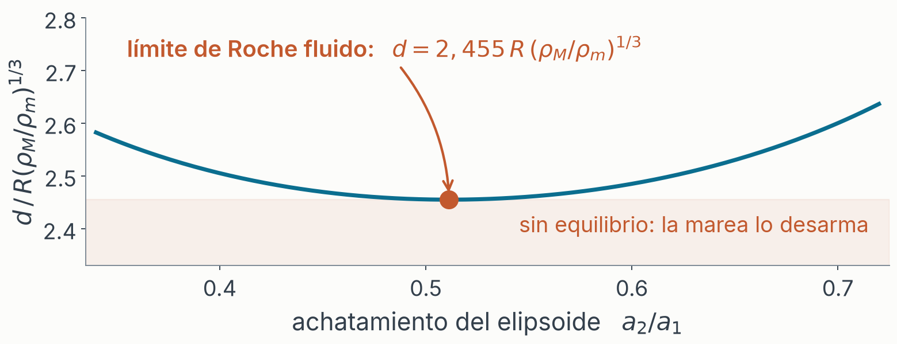

# Quién soy

- Ezequiel
- Soy programador
- Lic. Física, 2005 – 2011
- Me faltan dos materias

---

# Mareas

---

# De dónde sale la marea

## No es la atracción: es la diferencia

- La Luna tira de **todo** a la vez: del agua, de la roca, del planeta entero. Y todo cae hacia ella junto.
- La Tierra está en **caída libre**, y en caída libre la gravedad uniforme es invisible. Sólo se nota lo que *varía* de un punto a otro.
- Potencial de la Luna en una estación $\mathbf{r}$, con la Luna en $\mathbf{d}$:  $\Phi = -GM/|\mathbf{d}-\mathbf{r}|$
- Le quitamos las dos piezas que **no** levantan marea:
  - $-GM/|\mathbf{d}|$: constante en toda la Tierra, y un potencial constante no ejerce fuerza
  - el término **lineal** en $\mathbf{r}$: la caída libre de la Tierra entera, se cancela

### $V(\mathbf{r}) = GM \left( \frac{1}{|\mathbf{d}-\mathbf{r}|} - \frac{1}{|\mathbf{d}|} - \frac{\mathbf{r}\cdot\mathbf{d}}{|\mathbf{d}|^3} \right)$   exacto

---

# Dos bultos, y por qué el Sol pierde

### $V \approx \frac{GM\,r^2}{2d^3}\,(3\cos^2\psi - 1)$   para $r \ll d$

- **Par en $\cos\psi$**: no distingue el lado cercano del lejano. **Dos bultos**: 0° y 180°.
- **$1/d^3$, no $1/d^2$**: el Sol gana 27 millones en masa; la Luna, 59 **al cubo**. **2.18 a 1**.

---

# La Luna se aleja, la Tierra se frena

- La rotación arrastra el bulto **por delante**. Apuntado exacto, el par sería **cero**.
- **El momento angular se conserva**: del giro de la Tierra a la órbita de la Luna.
- **3.8 cm/año** se aleja la Luna; **2.3 ms/siglo** se alarga el día.
- **Virial**: en una órbita $U = -2K$. Gana energía y va **más despacio**.
- Hace 620 millones de años: día de **21.9 h**, año de **400 días**. ¡Eran más cortos!

---

# El límite de Roche: marea contra gravedad propia

Un satélite de masa $m$ y radio $r$, a distancia $d$ de un planeta de masa $M$. Sobre un trozo $\delta m$ de su superficie compiten dos fuerzas:

- Lo que lo **sujeta**, la gravedad del propio satélite: $F_{propia} = G\,m\,\delta m / r^2$
- Lo que lo **arranca**, la marea del planeta: $F_{marea} \approx 2\,G\,M\,\delta m\,r / d^3$

### Se rompe cuando la marea gana: $\frac{Gm}{r^2} = \frac{2GMr}{d^3}$

### $d = r \left( \dfrac{2M}{m} \right)^{1/3}$

---

# El tamaño se cancela: sólo cuentan las densidades

Con $M = \frac{4}{3}\pi R^3 \rho_M$ y $m = \frac{4}{3}\pi r^3 \rho_m$, el radio $r$ del satélite desaparece:

### $d = R \left( \dfrac{2\rho_M}{\rho_m} \right)^{1/3} \approx 1{,}26\, R \left( \dfrac{\rho_M}{\rho_m} \right)^{1/3}$

- Un guijarro y una luna se rompen **a la misma distancia**. No importa el tamaño, sólo lo densos que sean.
- Ese **1,26** vale para un cuerpo rígido. Si se deja deformar, se estira, se alarga y se rompe antes: **2,44**. Es el cálculo de Roche de 1848.
- Para Júpiter y un cuerpo de hielo: **1,42 $R_J$** rígido, **2,76 $R_J$** fluido.

---

# Los anillos de Júpiter y Shoemaker-Levy 9

- El **anillo principal** está en 1,7–1,8 $R_J$, dentro del límite: ahí el material no puede juntarse en una luna.
- **Metis y Adrastea** sobreviven ahí porque son sólidas y densas: para la roca rígida el límite cae dentro del planeta, en 0,96 $R_J$.
- **Shoemaker-Levy 9** pasó a 1,3 $R_J$ el 7 de julio de 1992. Escombros helados: se partió en más de 20 fragmentos, el *collar de perlas*, que cayeron del 16 al 22 de julio de 1994.

---

# La marea es una onda forzada (Laplace, 1776)

- Newton pedía que el bulto **siguiera** a la Luna: 40.000 km en un día lunar son **450 m/s** en el ecuador. Una onda larga en 4 km de océano va a $c = \sqrt{gh} \approx 200$ m/s. **No llega ni a la mitad.**

### $\partial_t \zeta + h\, \partial_x u = 0$    y    $\partial_t u = -g\, \partial_x \zeta + \partial_x V$

Derivando la continuidad y sustituyendo el momento:

### $\frac{\partial^2 \zeta}{\partial t^2} - gh\, \frac{\partial^2 \zeta}{\partial x^2} = -h\, \frac{\partial^2 V}{\partial x^2} = -gh\, \frac{\partial^2 \zeta_{eq}}{\partial x^2}$

- A la izquierda, una onda libre a $\sqrt{gh}$. A la derecha, el **forzamiento**: el mismo $V$ de la lámina 3, o su marea de equilibrio $\zeta_{eq} = V/g$. El océano es un **oscilador forzado**, no un bulto que sigue a la Luna.

---

# Los componentes armónicos: Kelvin, 1867

- El forzamiento tiene pocas frecuencias, y todas astronómicas: día lunar, mes, año, ciclo nodal de 18,6 años. Doodson (1921) desarrolló $V$ en **388 líneas**, cada una con seis enteros. De ahí los nombres M2, S2, N2, K1.
- Un sistema lineal forzado responde **en las frecuencias que lo fuerzan**, con su propia amplitud y fase en cada una. Y esas las pone el océano, no la astronomía.

### $\zeta(t) = \sum_i H_i \cos(\omega_i t - \phi_i)$

---

# 1872: la calculadora analógica de mareas

- **Una rueda por componente**: los engranajes ponen $\omega_i$, el radio de la manivela pone $H_i$, el calado inicial pone $\phi_i$. Un hilo las suma, una pluma la dibuja.
- Diez componentes, y un año de mareas de un puerto en **cuatro horas de manivela**.
- Con estas máquinas calculó Doodson las mareas del desembarco de Normandía: la hora H, y que el día D cayera entre el 5 y el 7 de junio de 1944.

---

# Cada física construye las máquinas que su paradigma permite

- La física del XIX es mecanicista: fuerzas, engranajes, cuerpos rígidos, el éter. Su computadora es **mecánica**: un sintetizador de Fourier de latón.
- El **transistor**, 1947, es la máquina típica del siglo XX, hija de la mecánica cuántica y la teoría de bandas. No había manera de construirlo antes, ni de imaginarlo.

---

<!-- layout: section -->

# Anexo

## A · el potencial, término a término

## B · el virial y el límite de Roche

---

# Anexo A · Geometría y el potencial exacto

- La Luna en $\mathbf{d}$, la estación en $\mathbf{r}$, las dos desde el centro de la Tierra, y $\psi$ el ángulo entre ellas: $|\mathbf{d}-\mathbf{r}| = \sqrt{d^2 - 2dr\cos\psi + r^2}$
- Potencial de la Luna en la estación: $\Phi = -GM/|\mathbf{d}-\mathbf{r}|$
- **Convenio de signo**: llamamos $V$ a *menos* el potencial generador, para que la marea de equilibrio sea $\eta = V/g$ y $V>0$ sea pleamar. La fuerza por unidad de masa es entonces $+\nabla V$.

### $V(\mathbf{r}) = GM \left( \frac{1}{|\mathbf{d}-\mathbf{r}|} - \frac{1}{d} - \frac{\mathbf{r}\cdot\mathbf{d}}{d^3} \right)$

- Exacto, sin truncar. Es lo que calcula `tide/potential.py:tide_generating_potential()`.

---

# Anexo A · El desarrollo de Legendre

### $\frac{1}{|\mathbf{d}-\mathbf{r}|} = \frac{1}{d} \sum_{n=0}^{\infty} \left( \frac{r}{d} \right)^n P_n(\cos\psi)$     para $r < d$

- $P_0 = 1$,    $P_1 = \cos\psi$,    $P_2 = \frac{1}{2}(3\cos^2\psi - 1)$,    $P_3 = \frac{1}{2}(5\cos^3\psi - 3\cos\psi)$
- El término $n=0$ vale $GM/d$: es **exactamente** la segunda pieza que restamos.
- El término $n=1$ vale $GM\,r\cos\psi/d^2 = GM\,\mathbf{r}\cdot\mathbf{d}/d^3$: es **exactamente** la tercera.
- Los dos primeros términos del desarrollo son las dos piezas que no hacen marea. No se desprecian: se cancelan.

---

# Anexo A · El cuadrupolo, y qué se desprecia

### $V = \frac{GM}{d} \sum_{n \geq 2} \left( \frac{r}{d} \right)^n P_n(\cos\psi)$

- El primer superviviente es $n=2$:   $V_2 = \frac{GM r^2}{d^3} P_2(\cos\psi) = \frac{GM r^2}{2d^3}(3\cos^2\psi - 1)$
- El siguiente es menor en un factor $r/d$. Para la Luna, $R_\oplus/d \approx 1/60$, o sea un 1,7%; el proyecto compara el exacto contra el cuadrupolo y mide **1,8%**.
- $P_2$ es **par** en $\cos\psi$: de ahí los dos bultos. Y es un armónico esférico de grado 2, de ahí que M2 vaya como $\cos^2\varphi$ y K1 como $|\sin 2\varphi|$.

---

# Anexo B · El virial escalar no basta

- Virial para un cuerpo fluido en equilibrio, sin movimiento interno: $3\int\! P\,dV + U_{propia} + W_{marea} = 0$
- Esfera homogénea de masa $m$ y radio $r$:   $U_{propia} = -\frac{3}{5}\frac{Gm^2}{r}$   y   $W_{marea} = -\frac{1}{5} n^2 m r^2$,   con $n^2 = GM/d^3$
- Los **dos** son negativos, así que la suma nunca da un criterio de ruptura. El virial escalar no ve que la marea estira en $x$ y comprime en $z$: promedia las direcciones.
- Hacen falta las ecuaciones viriales **tensoriales**, y dejar que el cuerpo **se deforme**. Y eso da el coeficiente fluido, no el rígido.

---

# Anexo B · Potencial de Hill y elipsoide homogéneo

- Marea más centrífuga en el marco corrotante, a segundo orden, con $n^2 = GM/d^3$:

### $\Phi_t = -V_2 + \Phi_{centr} = -\frac{1}{2} n^2 (3x^2 - z^2)$

- Elipsoide homogéneo de semiejes $a_1, a_2, a_3$:   $\Phi_{propia} = -\pi G\rho \left( A_0 - \sum_i A_i x_i^2 \right)$,   con $A_i = a_1 a_2 a_3 \int_0^\infty \frac{du}{(a_i^2+u)\Delta(u)}$ y $\sum_i A_i = 2$
- Equilibrio hidrostático: la superficie tiene que ser equipotencial, así que las tres formas cuadráticas son proporcionales. Con $\nu = n^2/\pi G\rho$:

### $a_1^2 \left( A_1 - \frac{3}{2}\nu \right) = a_2^2 A_2 = a_3^2 \left( A_3 + \frac{1}{2}\nu \right)$

---

# Anexo B · Dónde se acaba la secuencia

- Dos ecuaciones y dos cocientes de ejes: para cada $\nu$ hay un elipsoide de equilibrio, hasta que deja de haberlo. El máximo está en $\nu = 0{,}09009$, con $a_2/a_1 = 0{,}511$ y $a_3/a_1 = 0{,}483$.
- Como $\nu = \frac{4}{3}\frac{R^3}{d^3}\frac{\rho_M}{\rho_m}$, eso es $d = \left(\frac{4}{3\nu}\right)^{1/3} R \left(\frac{\rho_M}{\rho_m}\right)^{1/3} = \mathbf{2{,}455}\, R \left(\frac{\rho_M}{\rho_m}\right)^{1/3}$
- Ése es el 2,44 de la lámina 7 y de `docs/05`, calculado en vez de citado. Dejar que el cuerpo se deforme casi **duplica** el límite rígido de 1,26.
